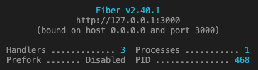

# Dockerized RESTful services in Go

## Environment Setup / Pre-requisite

> Please install the following for running OS environment before continue:

1. [Go](https://go.dev/doc/install)
2. [Docker](https://www.docker.com/products/docker-desktop/)
3. [Postman](https://www.postman.com/downloads/)

---

## Quick Start

1. Git clone current repository to your local environment and open with preferred IDE [eg: VS code].
2. Rename [.env.example](./.env.example) to `.env` file .
3. Make sure `no other application` running at port `3000` as it will be used by the application.
4. Make sure docker is already running at local environment.
5. Open terminal in `project root path` and run following command to verify docker are running:

```bash
# View installed docker version
docker version
```

6. If docker is not running, please run docker and repeat Step 4.
7. At the terminal, run following command to start `containerized RESTful services` in Go with Postgres database via Docker.

```bash
# Create docker instance based on docker-compose.yml
docker compose up
```

8. Make sure terminal have the following:

   

9. Open Postman and start to send RESTful API with correct parameter as stated in API sesison.

---

## API Endpoints Reference

> `GET` http://localhost:3000/

This API will return the raw JSON format of stored object in Postgres. Hence, it will be empty by default and item will be displayed after running `POST` request for at least once and success.

````JSON
Response

```json
[
{
  "ID": 1,
  "CreatedAt": "2022-12-14T14:42:59.162640885Z",
  "UpdatedAt": "2022-12-14T14:42:59.162640885Z",
  "DeletedAt": null,
  "question": "Is this a sample?",
  "answer": "Yes"
},
{
    "ID": 2,
    "CreatedAt": "2022-12-14T14:45:11.451989Z",
    "UpdatedAt": "2022-12-14T14:45:11.451989Z",
    "DeletedAt": null,
    "question": "Is this a sample too?",
    "answer": "Yea!"
}
]
````

---

> `POST` http://localhost:3000/fact

Use `Postman` and create a new POST request.

Then, choose `Body` , then `raw` and make sure JSON is selected. Paste in the following skeleton and fill in accordingly.

Body

| name     | required |
| -------- | -------- |
| question | `yes`    |
| answer   | `yes`    |

Sample Body

```JSON
{
  "question": "Who learn Golang today?",
  "answer": "Me!",
}
```

Response

```json
{
  "ID": 1,
  "CreatedAt": "2022-12-14T14:42:59.162640885Z",
  "UpdatedAt": "2022-12-14T14:42:59.162640885Z",
  "DeletedAt": null,
  "question": "Who learn Golang today?",
  "answer": "Me!"
}
```

---

## Third-party Golang package/modules installed

- Go-fiber
- Gorm with Postgres driver
- Air
